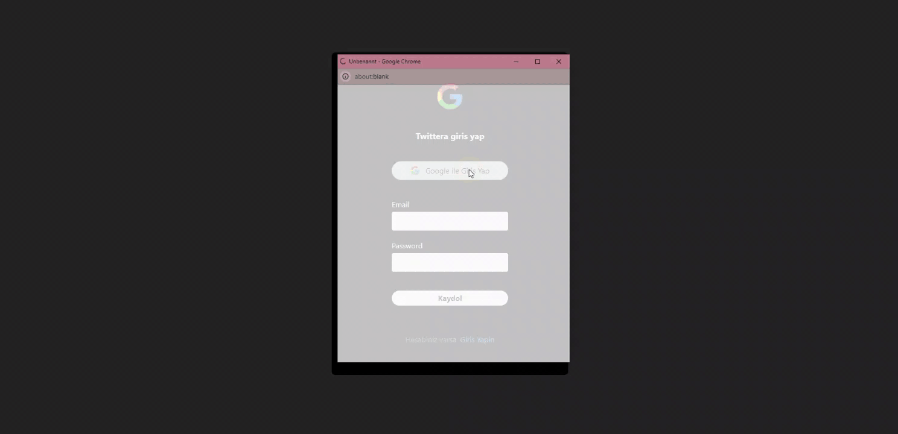

# Twitter Clone with Firebase

This project is a Twitter clone application that allows users to authenticate, send messages, and interact in real time. It is developed using React and Firebase.

## Features

- **User Authentication**: Supports various authentication methods such as username/password, fingerprint, and Google account.
- **Real-Time Messaging**: Users can send and receive messages in real time.
- **User Profiles**: Each user can manage their profile.
- **Dropdown Menus**: Interactive dropdown menus implemented with custom code from Universe.io.
  
## Libraries and Technologies

- **React Router DOM**: For routing within the application.
- **React Toastify**: For displaying notifications.  
  To use it, add the following imports in `main.jsx`:
  ```javascript
  import { ToastContainer } from "react-toastify";
  import "react-toastify/dist/ReactToastify.css";


## Preview

# Twitter--Firebase
